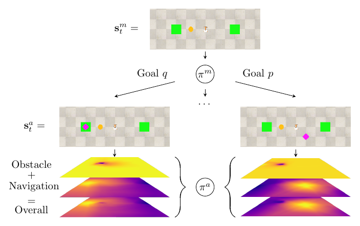

# Hierarchical goals contextualize local reward decomposition explanations

This repository contains the source code and data for the paper *"Hierarchical goals contextualize local reward decomposition explanations"*. We provide code to inspect a trained agent as well as code to train an agent from scratch, on the navigation environment used in the paper.

<center>

</center>


## Installation
If you start from a completely blank Ubuntu/Debian machine, install these packages:
```bash
sudo apt-get install gcc libpq-dev -y
sudo apt-get install python-dev  python-pip -y
sudo apt-get install python3-dev python3-pip python3-venv python3-wheel -y
pip3 install wheel -y

```

We used the robot simulator CoppeliaSim, which is freely available for educational purposes. Furthermore, we interact with CoppeliaSim through PyRep, which requires a specific version of CoppeliaSim. Download and install CoppeliaSim and PyRep following the instructions [here](https://github.com/stepjam/PyRep). If PyRep complains about not finding some QT plugins, you probably didn't set the environment variables correctly. 

Next, install the requirements specifically needed for this code (either globally or in a virtual environment, but ensure that PyRep is available in whichever environment you are using):
```bash
git clone https://github.com/frietz58/hdddqn.git 
cd hdddqn
pip3 install -r requirements.txt --user  # omit --user if installing in venv
```

In addition, install [PyTorch](https://pytorch.org/get-started/locally/) and potentially CUDA for GPU acceleration. We used **torch 1.10.1** with **cuda 11.3**, but other versions should work as well:
```bash
pip3 install torch torchvision torchaudio --extra-index-url https://download.pytorch.org/whl/cu113
```

Lastly, for convenient imports anywhere, our codebase implements a pip package. Install it by running (still in folder `hdddqn`):
```bash
pip3 install -e .
```


## View trained agent

To view a trained agent, simply run:
```bash
python3 view_decomposed_agent.py
```
This script simply executes 10 trajectories with random initial positions. In lines 12-15 we specify from where to load the learned weights for the decomposed value function networks that yield the policy. This is followed by some ugly import hackery to dynamically import the networks architecture depending on a string value found at the specific checkpoint. Lines 87-139 contain the main loop and intuitively demonstrate the interaction between the meta controller that selects goals at a slower timescale than and the atomic controller that generates agent actions and explanations.

### Recording data
To record trajectory data, pass the argument `--record_data` to the `view_trained_agent.py` script. This will save all states and $Q$-values encountered during the rollouts in a folder in the `checkpoints` folder for whichever checkpoint you are currently using. This data can be plotted by calling (adjust the path in the script to the trajectory you wish to plot):

```bash
python3 create_plots.py
```


## Train new agent
To train a new agent from scratch, on our simple navigation environment, run:
```bash
python3 train_decomposed_agent.py
```

There is [some issue ](https://github.com/stepjam/PyRep/issues/12) with PyRep that causes the script to ignore `sigint` signals (CTRL + C), instead either kill the python process manually or press CTRL + \ to send `sigterm`. Lines 46-89 specify hyperparameters for the experiment. It is also possible to pass a list `.yaml` configuration file to the script that contains a dictonary of hyperparameters (for an example, see file `checkpoints/2022.02.22-22:56:22/param_configuration.yaml`).

